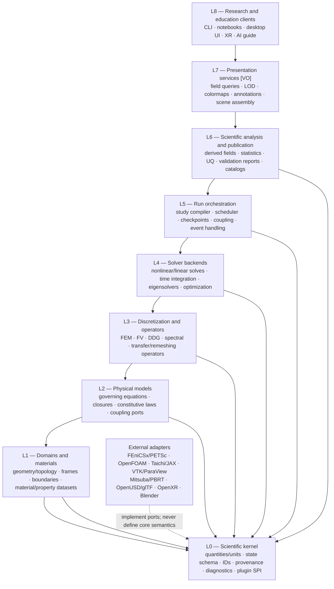
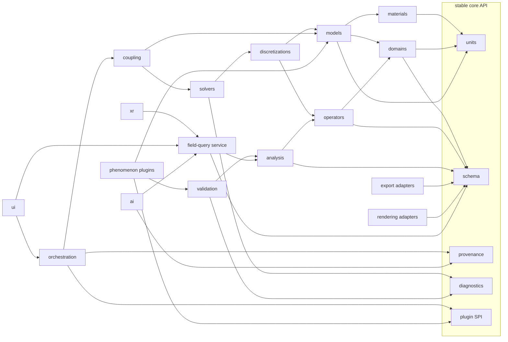
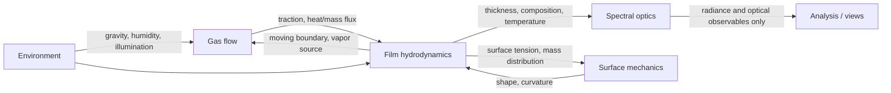

# Long-term scientific architecture

Status: architectural baseline, 2026-08-02. This document defines boundaries
and invariants, not implementation details. Architectural decisions that later
change these invariants require an ADR and a data-migration plan.

## Classification legend

| Mark | Meaning |
|---|---|
| **PV** | Physically validated within an explicitly stated regime and error budget |
| **EA** | Engineering approximation derived from physics, with documented assumptions |
| **VO** | Visualization-only; must never alter or masquerade as scientific state |
| **SF** | Speculative future work; no present claim of correctness or feasibility |

Validation is attached to a particular model, implementation, parameter regime,
quantity of interest, and software version. A module is never “validated” in the
abstract.

## Architectural invariants

1. The authoritative product is immutable, unit-bearing scientific state—not a
   Blender file, shader, image, or XR scene.
2. Equations and constitutive laws do not depend on meshes, solvers, renderers,
   applications, or vendor APIs.
3. Discretizations do not own physical parameters or presentation behavior.
4. Every derived field records its source fields, algorithm, parameters, and
   uncertainty or known error limitations.
5. Visualization may resample, color, simplify, and interpolate only in a
   derived view with an explicit link to source state.
6. Interactive edits become typed experiment commands: parameter changes,
   initial conditions, boundary conditions, sources, or forces. They create a
   new run lineage rather than rewriting history.
7. Plugins communicate through versioned capability and data contracts. The
   core never imports a phenomenon plugin.
8. Reproducibility metadata, validation results, and citations are first-class
   data, not prose added after a result is produced.

## 1. Layered system architecture

Arrows represent control/data use from a higher layer to a lower layer. Lower
layers have no knowledge of higher layers.

### Layer responsibilities

| Layer | Owns | Explicitly does not own | Classification |
|---|---|---|---|
| L0 kernel | schemas, units, identities, manifests, plugin contracts | equations, GPU kernels, UI | Infrastructure; validation-enabled |
| L1 domains/materials | meshes/grids/particles/manifolds, coordinate frames, measured properties | time stepping, coloring | **PV** when data/geometry are traceable; otherwise **EA** |
| L2 models | strong/weak equations, closures, regimes, exchanged quantities | discrete matrices, scene nodes | **PV**, **EA**, or **SF**, declared per model |
| L3 discretization | spaces, stencils, quadrature, operators, adaptivity, transfers | physical interpretation | Numerically verified; not itself physical validation |
| L4 solvers | algebraic/time/eigen/optimization algorithms and convergence | physical truth claims | Numerically verified |
| L5 orchestration | run lifecycle, coupling, checkpoints, deterministic replay | equations, render styles | Partitioned coupling is commonly **EA** |
| L6 analysis | derived quantities, validation/UQ, publication datasets | mutation of source frames | **PV/EA** analyses with provenance |
| L7 presentation | view-state, LOD, interpolation, colormaps, scene composition | authoritative values | **VO** |
| L8 clients | experiment authoring, exploration, instruction, explanation | direct mutation of datasets | UI is **VO**; AI causality is **SF** until evaluated |

## 2. Dependency graph between modules

An arrow `A --> B` means “A may depend on B.” Cycles are prohibited across
package boundaries. Within the solver runtime, feedback is represented as data
flow coordinated by `orchestration`, not as circular imports.

### Dependency rules

- `physics/` should become `models/` plus focused phenomenon packages; a general
  core must not accumulate unrelated equations.
- `surface/`, `fluid/`, and `optics/` are capability packages, not privileged
  layers. A bubble plugin composes them.
- Backend packages depend inward on abstract contracts. Core packages never
  branch on “FEniCSx,” “Taichi,” “Blender,” or “OpenXR.”
- `ai/` is a read-mostly explanation client. It cannot bypass the field-query
  and provenance services or issue solver changes without a typed, reviewable
  command.
- The canonical scientific store is backend-neutral. VTKHDF is a strong
  visualization/checkpoint adapter because its versioned format supports
  polydata, unstructured grids, AMR, multiblock, and partitioned collections;
  it does not become the in-memory object model.

## 3. Simulation lifecycle

```mermaid
flowchart LR
  A["1 Study specification"] --> B["2 Resolve plugins\nand environment"]
  B --> C["3 Dimensional and\nregime preflight"]
  C --> D["4 Construct domains,\nmaterials, ICs and BCs"]
  D --> E["5 Discretize and\ninitialize state"]
  E --> F["6 Solve / couple /\nadapt / checkpoint"]
  F --> G{"Acceptance\ncriteria met?"}
  G -- "no: fail with diagnostics" --> H["Rejected or incomplete run"]
  G -- yes --> I["7 Verify and validate\nquantities of interest"]
  I --> J["8 Publish immutable\nscientific dataset"]
  J --> K["9 Derive multiresolution\nview products [VO]"]
  K --> L["10 Stream to desktop,\nParaView, Blender, XR"]
  L --> M["11 Query fields and\nmodel provenance"]
  M --> N{"User changes\nexperiment?"}
  N -- no --> L
  N -- yes --> O["12 Create child study\nwith explicit command"]
  O --> B
```

| Stage | Required output | Failure behavior |
|---|---|---|
| Study specification | declarative model, parameters, units, domains, outputs, tolerances | reject ambiguous units or unavailable capabilities |
| Resolution | exact plugin/backend versions and environment lock | fail before allocating a solver |
| Preflight | nondimensional groups, model-regime checks, scale estimates, memory/time estimate | hard error for invalid dimensions; explicit waiver for regime warnings |
| Initialization | validated topology, coordinate frames, initial/boundary fields, deterministic seed | no “best effort” repair without provenance |
| Execution | ordered frames, residuals, conservation budgets, adaptivity history, checkpoints | retain last consistent checkpoint and typed failure report |
| V&V | code-verification and solution-verification results; experiment comparison when claimed | output remains usable but cannot receive a stronger fidelity label |
| Publication | immutable run ID, manifest, citations, checksums, field catalog | never overwrite; supersede with lineage |
| Visualization | source references, LOD/resampling record, presentation state | degraded rendering must not alter source state |
| Interaction | spatial query with source frame/entity/time and interpolation details | out-of-domain queries return uncertainty/failure, not invented values |

OpenXR spaces must be treated as presentation coordinate frames mapped from a
simulation frame; OpenXR actions should map to semantic experiment commands,
not device-specific buttons. Both choices follow OpenXR's portable spaces and
action abstractions and remain **VO** until a command creates a child study.

## 4. Coupling architecture

Each model exposes typed input/output ports: field semantic ID, domain,
association, unit dimension, frame, time semantics, continuity requirements,
and acceptable interpolation error. The coupling plan chooses transfer,
ordering, subcycling, relaxation, and convergence criteria.

- Loose one-way or staggered coupling is **EA** and acceptable during staged
  development when feedback is demonstrably negligible.
- Iterated partitioned coupling is **EA** until temporal and interface-transfer
  error are quantified.
- Strong/monolithic coupling is a **PV-capable method**, not automatically more
  correct; it is warranted for stiff feedback or conservation failures.
- Optics is initially diagnostic one-way coupling. Photothermal or radiation
  pressure feedback is **SF** until scale analysis demonstrates relevance.

## 5. Storage, interchange, and coordinate systems

The storage model has four tiers:

1. **Working state:** backend-native arrays behind stable field/domain views.
2. **Checkpoint state:** lossless, restartable, parallel-friendly scientific
   data plus a manifest. VTKHDF and HDF5/XDMF adapters are candidates; openPMD
   should be evaluated for structured mesh/particle phenomena because it
   standardizes SI scaling, unit dimensions, geometry, time, and iteration.
3. **Publication state:** immutable content-addressed run bundle with validation
   evidence, environment lock, checksums, and migration version.
4. **View products:** ParaView extracts, OpenUSD scenes, glTF, images, video, and
   XR LOD tiles. These are **VO** and never sufficient to restart a run.

OpenUSD is appropriate for layered scene composition and references to
scientific assets, but not as the sole field archive. The simulation-to-world
transform, handedness, axis convention, length scale, origin, and timestamp are
mandatory in every adapter.

## 6. Cross-cutting services

- **Units and dimensions:** seven SI base-dimension exponents plus a scale and
  optional semantic unit string. Internal nondimensional variables retain their
  reference scales.
- **Identity:** stable UUID/content IDs for studies, runs, frames, domains,
  entities, fields, models, plugins, and derived products.
- **Provenance:** W3C-PROV-compatible concepts may be mapped later (**EA**), but
  source artifact, activity, agent/software, parameters, and lineage are needed
  immediately.
- **Uncertainty:** separate parameter, discretization, model-form, experimental,
  and interpolation uncertainty. A single opaque “confidence” number is banned.
- **Diagnostics:** residual norms, invariant budgets, CFL/stiffness measures,
  nonlinear/linear iterations, rejected steps, mesh quality, and warnings.
- **Security:** untrusted plugins are never loaded into a research process by
  default. In-process Python discovery is an initial **EA**; isolated workers
  with resource limits are a later hardening step.
- **Reproducibility:** exact configuration, seed, dependency lock, platform,
  floating-point mode, mesh, data sources, and git/plugin revisions.

## External standards informing this design

- [ASME V&V 20](https://www.asme.org/codes-standards/find-codes-standards/standard-for-verification-and-validation-in-computational-fluid-dynamics-and-heat-transfer/2009)
  separates numerical/experimental uncertainty from model comparison and
  validates specified quantities at specified points rather than an entire code.
- [VTKHDF specification](https://docs.vtk.org/en/v9.6.0/vtk_file_formats/vtkhdf_file_format/vtkhdf_specifications.html)
  provides versioned scientific visualization structures.
- [openPMD](https://www.openpmd.org/) provides useful precedents for SI scaling,
  dimension vectors, time, iteration, mesh, and particle records.
- [OpenXR registry](https://registry.khronos.org/OpenXR/) defines the portable XR
  spaces/actions boundary.
- [OpenUSD introduction](https://openusd.org/release/intro.html) defines layered
  scene composition suitable for derived presentation assets.
