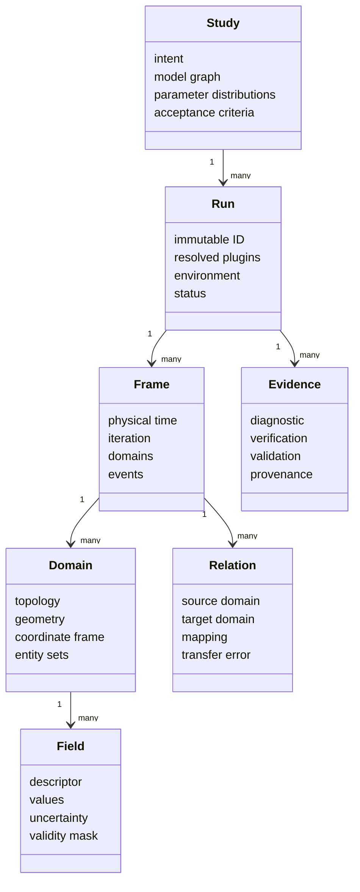

# Scientific data model

The data model must describe soap films now and unrelated phenomena later
without turning the core into an ever-growing list of special cases. It therefore
defines universal containers and a namespaced semantic field registry.

## Object hierarchy

## Universal domain types

| Domain kind | Examples | Native entities |
|---|---|---|
| Structured grid | atmosphere, image-like thickness map | node, cell, face, edge |
| Unstructured volume mesh | air, plasma, heat-transfer solid | vertex, cell, facet, edge |
| Surface/manifold mesh | bubble mid-surface, interfaces, membranes | vertex, face, edge |
| Curve/network | Plateau borders, filaments, vascular networks | vertex, segment, junction |
| Particle set | droplets, stars, molecules, tracers | particle, species/group |
| Material point/cloud | mesh-free continuum models | point, neighborhood |
| Spectral/angular domain | wavelength, frequency, direction, harmonic modes | bin/sample/mode |
| Parameter domain | ensembles, uncertainty samples, optimization | realization |

Domains may be Eulerian, Lagrangian, ALE, or purely referential. That choice is
metadata; it must not be inferred from file layout.

## Field descriptor contract

Every field carries the following information, whether stored inline or by
reference:

| Property | Purpose |
|---|---|
| Semantic ID | stable namespaced meaning, e.g. `surface.film_thickness` |
| Display symbol/name | human notation; never the sole identifier |
| Value shape | scalar, vector, tensor, complex scalar/vector, spectrum, distribution |
| Numeric representation | dtype, component ordering, complex convention |
| Unit dimension and scale | SI base exponents plus conversion to SI; `1` if dimensionless |
| Domain and association | exact domain and entity kind on which samples live |
| Basis/interpolation | cellwise constant, nodal P1/P2, staggered face flux, spectral basis, etc. |
| Coordinate frame | frame for vectors/tensors and component transformation law |
| Time semantics | instantaneous, interval average, accumulated flux, eigenmode, steady |
| Role | primary unknown, prescribed input, derived observable, diagnostic, uncertainty |
| Conservation semantics | intensive/extensive, conserved quantity, density, flux, source |
| Validity | mask, physical range, model regime, and missing-data representation |
| Uncertainty | type, distribution/interval/covariance, source, correlation identifier |
| Provenance | producer model/operator, input field IDs, version, parameters, citations |
| Fidelity | **PV**, **EA**, **VO**, or **SF**, with evidence link |

Two equally shaped arrays are not interchangeable unless their semantic IDs,
unit dimensions, domains, associations, time semantics, and frames are
compatible. Unit conversion alone is insufficient.

## Canonical initial field registry

This is an extensible registry, not a closed enumeration. All authoritative
fields are SI-scaled. “Derived” means recomputable and does not imply lower
scientific value.

### Geometry and topology

| Semantic field | Symbol | Unit | Association | Role/status |
|---|---:|---:|---|---|
| `geometry.position` | **x** | m | vertex/particle | primary, **PV-capable** |
| `geometry.displacement` | **u** | m | vertex/material point | primary/derived |
| `geometry.normal` | **n** | 1 | surface entity | derived; discretization-dependent |
| `geometry.area_measure` | dA | m² | face/quadrature | derived |
| `geometry.volume_measure` | dV | m³ | cell/quadrature | derived |
| `geometry.metric_tensor` | g | 1 or mapped units | quadrature | derived |
| `geometry.mean_curvature` | H | m⁻¹ | surface | derived, signed convention required |
| `geometry.gaussian_curvature` | K | m⁻² | surface | derived |
| `geometry.principal_curvatures` | κ₁,κ₂ | m⁻¹ | surface | derived |
| `geometry.signed_distance` | ϕ | m | volume/grid | primary/derived, **EA** when reconstructed |
| `mesh.characteristic_size` | hₑ | m | cell/face | diagnostic |
| `mesh.quality` | q | 1 | cell/face | diagnostic; metric named explicitly |

### Kinematics and mechanics

| Semantic field | Symbol | Unit | Association | Role/status |
|---|---:|---:|---|---|
| `kinematics.velocity` | **v** | m s⁻¹ | node/cell/particle | primary |
| `kinematics.acceleration` | **a** | m s⁻² | node/cell/particle | primary/derived |
| `mechanics.pressure` | p | Pa | cell/surface | primary |
| `mechanics.pressure_jump` | Δp | Pa | interface | derived/constraint |
| `mechanics.cauchy_stress` | σ | Pa | cell/quadrature | primary/derived |
| `mechanics.traction` | **t** | Pa | boundary/interface | exchanged quantity |
| `mechanics.body_force_density` | **f** | N m⁻³ | volume | prescribed/derived |
| `mechanics.surface_force_density` | **f**ₛ | N m⁻² | surface | prescribed/derived |
| `mechanics.surface_tension` | γ | N m⁻¹ | interface | constitutive/primary |
| `mechanics.surface_stress` | τₛ | N m⁻¹ | interface | derived/constitutive |
| `mechanics.vorticity` | **ω** | s⁻¹ | volume/surface | derived |
| `mechanics.strain_rate` | D | s⁻¹ | cell/quadrature | derived |

### Soap-film hydrodynamics

| Semantic field | Symbol | Unit | Association | Role/status |
|---|---:|---:|---|---|
| `film.thickness` | h | m | mid-surface | primary; total thickness convention |
| `film.half_thickness` | a | m | mid-surface | derived or primary; never confuse with `h` |
| `film.tangential_velocity` | **u**ₛ | m s⁻¹ | surface | primary/averaged, **EA** in reduced models |
| `film.liquid_flux` | **q** | m² s⁻¹ | surface edge/face | conserved flux |
| `film.volume_per_area` | V/A | m | surface | conserved density |
| `film.capillary_pressure` | pγ | Pa | surface | derived |
| `film.disjoining_pressure` | Π | Pa | surface | constitutive, regime-specific **EA/PV** |
| `film.evaporation_mass_flux` | jₑ | kg m⁻² s⁻¹ | interface | source/sink, usually **EA** |
| `film.drainage_rate` | ∂h/∂t | m s⁻¹ | surface | derived |
| `film.interface_separation_error` | eₕ | m | surface | diagnostic |
| `film.rupture_event` | — | 1/event | surface/time | event with model and probability, not a color mask |

### Surfactant and composition

| Semantic field | Symbol | Unit | Association | Role/status |
|---|---:|---:|---|---|
| `surfactant.surface_concentration.outer` | Γ⁺ | mol m⁻² | outer interface | primary |
| `surfactant.surface_concentration.inner` | Γ⁻ | mol m⁻² | inner interface | primary |
| `surfactant.bulk_concentration` | c | mol m⁻³ | film volume/reduced surface | primary |
| `surfactant.surface_flux` | **J**Γ | mol m⁻¹ s⁻¹ | interface | conserved flux |
| `surfactant.adsorption_flux` | jₐ | mol m⁻² s⁻¹ | interface | constitutive source |
| `surfactant.chemical_potential` | μ | J mol⁻¹ | surface/volume | derived/constitutive |
| `surfactant.marangoni_stress` | ∇ₛγ | Pa | interface | derived |
| `composition.mass_fraction` | Yᵢ | 1 | domain | primary |
| `composition.species_concentration` | cᵢ | mol m⁻³ | domain | primary |

### Thermal and environment

| Semantic field | Symbol | Unit | Association | Role/status |
|---|---:|---:|---|---|
| `thermal.temperature` | T | K | any physical domain | primary |
| `thermal.heat_flux` | **q**ₜ | W m⁻² | face/interface | flux |
| `thermal.heat_source` | Q | W m⁻³ | volume | source |
| `environment.gravity` | **g** | m s⁻² | global/domain | prescribed |
| `environment.relative_humidity` | RH | 1 | gas/global | measured/prescribed |
| `environment.vapor_concentration` | cᵥ | mol m⁻³ | gas | primary |
| `environment.ambient_pressure` | p∞ | Pa | boundary/global | measured/prescribed |
| `environment.air_velocity` | **u**g | m s⁻¹ | gas | primary/prescribed |

### Optical and radiometric fields

Wavelength/frequency coordinates are explicit axes, not encoded in field names.

| Semantic field | Symbol | Unit | Association | Role/status |
|---|---:|---:|---|---|
| `optics.complex_refractive_index` | n + iκ | 1 | material × wavelength | measured/constitutive |
| `optics.optical_thickness` | nh cosθ | m | interface × wavelength | derived |
| `optics.phase_thickness` | δ | rad | interface × wavelength | derived |
| `optics.reflectance.s/p` | Rₛ,Rₚ | 1 | interface × wavelength/angle | derived, **PV** for ideal slab |
| `optics.transmittance.s/p` | Tₛ,Tₚ | 1 | interface × wavelength/angle | derived |
| `optics.absorptance` | A | 1 | interface × wavelength/angle | derived |
| `optics.jones_matrix` | J | 1 | optical interaction | complex derived, future |
| `optics.mueller_matrix` | M | 1 | optical interaction | derived, future |
| `optics.stokes_vector` | S | radiometric units | ray/sensor | derived, future |
| `radiometry.spectral_radiance` | Lλ | W m⁻² sr⁻¹ m⁻¹ | direction/position/λ | derived observable |
| `radiometry.spectral_irradiance` | Eλ | W m⁻² m⁻¹ | surface/λ | derived observable |
| `color.display_rgb` | — | 1 | view pixel/entity | **VO**, never authoritative optics |

### Modal, event, and diagnostic fields

| Semantic field | Unit | Role |
|---|---:|---|
| `modal.eigenvalue` / `modal.frequency` / `modal.damping_ratio` | problem-specific / Hz / 1 | derived mode data |
| `modal.shape` | field unit | complex or real eigenfield with normalization |
| `numerics.residual` | equation-specific | equation residual, norm definition required |
| `numerics.local_error_estimate` | field-specific | temporal/spatial estimator |
| `numerics.cfl_number` | 1 | stability diagnostic |
| `numerics.conservation_error` | conserved-unit | signed budget with boundary/source terms |
| `validation.comparison_error` | quantity-specific | simulation minus reference |
| `uncertainty.standard_uncertainty` | quantity-specific | component-specific uncertainty |
| `events.topology_change` | event | timestamp, location, cause model, pre/post lineage |

## Extension families for future phenomena

Plugins may register fields under controlled namespaces without core changes:

- phase/order parameters, chemical potentials, nucleation and reaction rates;
- electromagnetic **E**, **D**, **B**, **H**, charge and current density;
- plasma distribution functions, species moments, collision and source terms;
- radiation intensity, opacity, emissivity and radiation moments;
- elasticity, growth tensors, damage and biological signaling fields;
- particles, grains, crystal orientation and defect-density fields;
- gravitational potentials, spacetime metric/tetrads and curvature tensors;
- quantum wavefunctions/density matrices only in dedicated plugins (**SF**).

Registration requires dimensions, transformation behavior, association,
conservation semantics, and collision-free namespace ownership. A display label
alone is insufficient.

## Derived views and field queries

An XR/AI field query returns: run ID, frame/time, domain/entity, world and
simulation coordinates, semantic field ID, value, unit, basis/interpolation,
source samples, uncertainty, validity, producer model, fidelity label, and
citations. LOD values also return aggregation/error metadata.

Display colormaps, glyphs, streamlines, iso-surfaces, volume rendering,
exaggerated displacement, and temporal interpolation are all **VO**. They must
be stored as view configuration or derived view products, never written back
into the source field.
