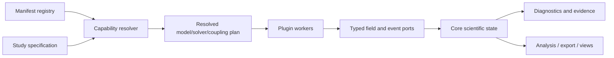

# Phenomenon plugin architecture

## Goal

A crystal-growth, plasma, cloud, morphogenesis, or relativity package should be
installable without editing the core repository. The core supplies scientific
contracts and orchestration; a plugin supplies domain-specific meaning.

## Stable core versus extension points

The stable core owns only:

- quantities, dimensions, coordinate frames, identities, state and provenance;
- domain/entity abstractions and field descriptors;
- capability discovery and compatibility negotiation;
- run lifecycle, diagnostics, checkpoints, commands, and evidence records;
- coupling-port and field-query contracts.

Plugins may contribute:

| Plugin capability | Examples |
|---|---|
| Phenomenon bundle | soap bubble, snowflake, plasma discharge |
| Governing model | Young–Laplace, reaction–diffusion, Maxwell, MHD |
| Constitutive law | equation of state, viscosity, surface tension, opacity |
| Domain factory | sphere surface, crystal lattice, adaptive volume mesh |
| Discretization | surface FEM, finite volume, particle method |
| Solver/backend | PETSc/FEniCSx, Taichi, JAX, OpenFOAM bridge |
| Coupler | gas–film, thermocapillary, radiation–matter |
| Initial/boundary condition | measured profile, inflow, contact line |
| Diagnostic/derived field | curvature, vorticity, optical phase |
| Validator | analytical, manufactured, benchmark, experimental comparison |
| Import/export | VTKHDF, openPMD, OpenUSD, Blender |
| View recipe | glyph/colormap/iso-surface defaults, always **VO** |
| Explanation provider | equations, assumptions, citations, causal graph |

## Capability manifest

Every distribution declares, without importing executable plugin code:

- globally unique plugin ID, semantic version, license, maintainers;
- core API compatibility range and required capabilities;
- contributed capability IDs and versions;
- field namespaces owned and field descriptors registered;
- supported domain kinds, hardware/backends, precision, and parallel model;
- fidelity status for each model and links to evidence—not one badge for the
  whole plugin;
- citations, datasets and data licenses;
- determinism/security declarations and resource expectations;
- configuration schema and migrations;
- optional external executables and how their versions are resolved.

Python entry points are the recommended initial discovery mechanism because
they are a packaging interoperability standard for installed distributions:
[PyPA entry-points specification](https://packaging.python.org/en/latest/specifications/entry-points/).
Discovery reads manifests first; executable loading occurs only after dependency
resolution and policy checks.

The v0.1.0 vertical slice implements the smaller installed-entry-point subset:
discovery loads the registered plugin object and verifies that declared and
provided capabilities agree. It intentionally has no source-tree fallback, so
tests exercise the same standardized entry point used by a fresh editable
installation. Import-light manifest inspection and dependency negotiation are
future core work.

## Interaction model

Plugins do not call one another by package name. A model declares a required
capability or input port; the resolver selects a compatible provider. Coupling
passes immutable field views or explicit mutable work buffers owned by the
orchestrator. Transfers record interpolation, conservation properties, and
error estimates.

## Compatibility and evolution

- Core APIs use semantic versioning, but serialized schemas have independent
  versions and migrations.
- Capability contracts are small and versioned separately; avoid one enormous
  plugin base class.
- Required methods and data are structural contracts; optional behavior is
  advertised as capabilities, never detected by exceptions.
- Unknown fields and manifest metadata must survive lossless round trips.
- Deprecations last at least two minor releases; public datasets need migration
  tools across major schema versions.
- A compatibility suite is published so plugins can test without the core
  source tree.

## Execution and security

Initial local plugins may run in-process for simplicity (**EA**). Research and
education deployments must distinguish trusted and untrusted plugins. The
long-term execution modes are:

1. trusted in-process Python/C++ for low overhead;
2. isolated local worker with typed IPC and resource limits;
3. MPI/HPC worker or external solver process;
4. remote service for institutional infrastructure (**SF** until provenance,
   privacy, latency, and reproducibility contracts are solved).

No plugin receives ambient credentials or unrestricted filesystem access by
default. External solver stdout is not a scientific interface; fields,
diagnostics, checkpoints, and failures use structured contracts.

## Plugin quality levels

| Level | Minimum evidence |
|---|---|
| Experimental | manifest, schema validation, unit tests, explicit **SF/EA** status |
| Numerically verified | exact/manufactured cases, convergence and conservation evidence |
| Physically validated | scoped experimental comparison and uncertainty record |
| Reference | independent implementation comparison, maintained validation corpus, reproducible release artifacts |

Visualization recipes can be production-quality but remain **VO**. An AI
explanation provider can be well tested for grounding but remains distinct from
validation of the physical model it explains.

## Example composition without core changes

A future `openphenomena-crystal-growth` plugin could register a phase-field
model, order-parameter and concentration fields, anisotropic interfacial-energy
law, FEM/finite-difference discretizations, dendrite benchmarks, a VTKHDF
exporter recipe, and an explanation corpus. It would depend only on stable core
and capability packages; the core would learn no crystal-specific nouns.
