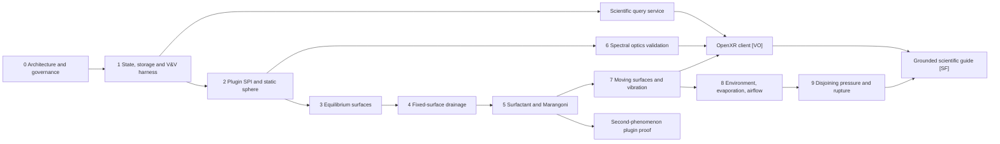

# Ten-year implementation roadmap

The ordering is evidence-driven. A later phase starts only when the preceding
phase's scientific and data contracts have credible tests. Small visualization
prototypes may occur earlier to test interfaces, but they do not move a physics
phase forward.

## Priority map

Phase numbers express dependency order, not calendar duration.

## Phase 0 — architecture and governance

Deliver now:

- architecture, field semantics, plugin contracts, fidelity policy;
- license/name/governance decisions, contribution and citation policies;
- supported Python/platform policy, dependency locking, CI matrix;
- ADR process and threat/reproducibility models.

Exit gate: a contributor can determine where a model belongs, how it declares
units/fidelity, and what evidence it needs without asking a maintainer.

## Phase 1 — scientific state and validation infrastructure

Implement first:

- full study/run/frame/domain/field/provenance schema;
- dimension and coordinate-frame library;
- immutable run manifests and checkpoint/restart semantics;
- VTKHDF/ParaView round trip and one archival-format evaluation;
- analytical/manufactured-solution harness, convergence runner, invariant
  budgets, golden data and benchmark reporting.

Exit gate: a synthetic multi-domain time series survives write/read with units,
associations, frames, IDs, uncertainty and provenance intact. CI demonstrates a
known convergence order and catches a deliberately introduced defect.

## Phase 2 — plugin SPI and static bubble reference

- manifest-only discovery, capability resolution and compatibility suite;
- deterministic quality-controlled sphere hierarchy;
- curvature, area, enclosed volume, thickness, pressure and spectral fields;
- ParaView export and separately marked Blender/OpenUSD/glTF views;
- analytical convergence against sphere geometry and `Δp=4γ/R`.

Exit gate: the bubble example is installed as a plugin and the core contains no
soap-specific branches. All derived fields link to source/evidence.

## Phase 3 — equilibrium surface mechanics

- variational surface-energy formulation with volume/boundary constraints;
- DDG and/or surface-FEM operators with independent reference comparison;
- gravity and capillary boundary conditions after zero-gravity cases;
- adaptive mesh quality and conservative field transfer policy.

Exit gate: sphere and selected constant-mean-curvature/capillary benchmarks show
expected convergence, small force/volume residuals, and reproducible results.

## Phase 4 — fixed-surface drainage

- publish the asymptotic derivation and nondimensional regime;
- begin planar/axisymmetric lubrication benchmarks, then a fixed manifold;
- positivity-preserving conservative thickness transport;
- Plateau-border boundary models isolated behind explicit contracts.

Exit gate: mass budgets close, manufactured solutions converge, thickness stays
physical, and at least one controlled drainage dataset is compared with an
uncertainty statement. Status remains **EA** outside the validated regime.

## Phase 5 — surfactant and Marangoni physics

- surface advection–diffusion, bulk exchange only after insoluble tests;
- material-specific equation of state for `γ(Γ,T,c)` with source data;
- tangential stress coupling, two-interface asymmetry where required;
- parameter sensitivity and uncertainty propagation.

Exit gate: liquid and surfactant balances, stress benchmarks, convergence, and
held-out concentration/tension or flow comparisons.

## Phase 6 — spectral optics and scientific rendering

This overlaps earlier physics because optics is initially one-way diagnostic.

- complex dispersive refractive-index datasets with provenance;
- absorbing transfer matrices, oblique incidence and energy accounting;
- calibrated illuminant/sensor/observer transforms;
- Mitsuba 3 spectral adapter and PBRT or analytical independent comparison;
- curved-surface applicability/error study.

Exit gate: measured reflection/transmission spectra are reproduced within a
declared uncertainty in the plane-film regime. RGB outputs remain **VO**.

## Phase 7 — moving surfaces and vibration

- ALE/geometric-conservation machinery and remeshing transfers;
- surface inertia/damping choices stated explicitly;
- linear modes before nonlinear forced dynamics;
- couple shape, thickness, and surfactant only after isolated benchmarks.

Exit gate: Rayleigh–Lamb mode frequencies/degeneracy and energy/volume budgets
meet thresholds; coupled results include temporal/coupling refinement.

## Phase 8 — environment, evaporation, and airflow

Order deliberately:

1. prescribed temperature/humidity and one-way evaporation;
2. measured diffusion-limited mass-transfer model;
3. prescribed airflow traction/mass-transfer coefficient;
4. one-way resolved gas flow;
5. two-way gas–film coupling only when feedback matters.

Exit gate: mass/energy/interface budgets and controlled environmental validation.

## Phase 9 — disjoining pressure, instability, and rupture

Intentionally wait until drainage, surfactant transport, moving meshes,
adaptivity and uncertainty are mature. Rupture spans molecular contamination to
continuum instability; a universal deterministic thickness cutoff is not a
physical model.

Exit gate: linear-instability growth, black-film equilibrium, stochastic
convergence, topology-change conservation, and experimental lifetime/location
distributions for a narrowly defined formulation. Until then: **SF/EA**.

## Phase 10 — spatial computing and scientific guide

The field-query API and desktop inspection tools come before a headset client.
Then add multiresolution streaming, OpenXR spaces/actions, stable entity picks,
unit-aware probes, layers and time navigation. The AI guide is built last on
the exact query/provenance/evidence graph and must abstain when causality is not
supported.

Exit gate: spatial queries reproduce source values within published LOD error;
coordinate transforms are tested; an evaluation corpus measures AI grounding,
citation, unit correctness, and abstention. XR rendering is **VO**; AI causal
guidance remains **SF** until evaluated.

## Phase 11 — prove generality with a second phenomenon

Do not wait for complete bubble physics. After the plugin SPI and core data
model stabilize, build one deliberately different reference plugin—preferably a
reaction–diffusion or phase-field crystal-growth model. It should exercise a
volume/structured domain, multiple species/order parameters, a different solver
backend, and the same validation/publication/XR query pipeline.

Exit gate: no core changes are required except genuinely universal contract
improvements accompanied by an ADR and compatibility tests.

## Components intentionally deferred

| Component | Why it waits | Earliest prerequisite | Status |
|---|---|---|---|
| Full Navier–Stokes resolution inside nanometric film | prohibitive multiscale cost; reduced model must be assessed first | lubrication validation and scale analysis | **SF** |
| Two-way turbulent airflow | coupling/closure complexity can hide basic errors | moving-film and one-way airflow validation | **EA/SF** |
| Physical rupture/topology change | depends on unresolved chemistry, disjoining pressure and contaminants | Phases 4–9 | **SF** |
| Polarization | valuable but not needed to validate thickness/reflectance pipeline | spectral optical validation | **SF** integration |
| Photothermal/radiation-pressure coupling | likely small for baseline bubble conditions | scale analysis demonstrating relevance | **SF** |
| Production Vision Pro/Quest apps | premature before stable query/LOD contracts | query service and OpenXR prototype | **VO** |
| Generative AI parameter inference | high risk of non-identifiability and false authority | UQ, inverse validation and provenance | **SF** |
| Vulkan/custom engine | high maintenance burden without proven need | profiled XR prototype | **VO/EA** |
| Galaxies, black holes, plasma, biology | each requires its own expert models and evidence | stable plugin SPI plus domain experts | **SF** plugins |

## Technology adoption rule

A technology enters the supported matrix only if it provides a measured
scientific, interoperability, or performance benefit; has a maintained adapter;
passes compatibility/round-trip/reference tests; and can be removed without
changing core semantics. FEniCSx is a candidate FEM backend, Mitsuba a candidate
spectral/polarized renderer, and OpenXR a presentation standard—not architectural
foundations.
