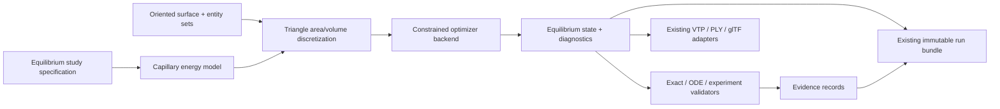

# Open Phenomena v0.2.0 design proposal: equilibrium capillary surfaces

Status: accepted and frozen, 2026-08-02. This document defines the scientific
scope and release gates for the transition from the validated static reference
in v0.1.0 to the first solved equilibrium geometry. It does not authorize
drainage, moving-surface dynamics, airflow, evaporation, surfactant transport,
or rupture. Future revisions require a demonstrated mathematical or
architectural problem discovered during implementation.

The program-level names in this proposal call v0.1.0 “Phase 1” and equilibrium
mechanics “Phase 2.” The older architecture roadmap counted governance and
infrastructure as phases 0--2, so its “Phase 3 -- equilibrium surface mechanics”
describes the same scientific milestone rather than a different intervening one.

## Executive decision

Open Phenomena v0.2.0 should implement a **volume-constrained variational
surface solver on oriented triangular meshes**. The primary discrete problem is
minimization of physical interfacial energy using exact triangle area and exact
oriented polyhedral volume, with analytic first derivatives and an explicit
equality-constrained optimizer. The Young--Laplace equation is not imposed as a
separate vertexwise rule; it is recovered as the Euler--Lagrange/KKT condition.

The first backend should be SciPy `trust-constr`, restricted to moderate serial
meshes and supplied with analytic objective and constraint derivatives. A
PETSc/TAO backend is a planned independent/scalable implementation after the
formulation and evidence schema are stable. Pointwise DDG curvature remains a
diagnostic and validation quantity, not the energy being minimized.

This choice deliberately targets stable equilibria of fixed topology. Direct
continuation of unstable constant-mean-curvature branches, contact-line
hysteresis, multi-bubble junctions, and topology change do not belong in the
v0.2.0 release gate.

## 1. Why equilibrium surfaces are the correct next milestone

The v0.1.0 sphere evaluates fields on a known exact geometry. The next genuine
scientific step is to make geometry an unknown while retaining a problem with a
clear variational principle, exact references, and no time-discretization or
constitutive ambiguity.

Equilibrium surface mechanics is the narrowest milestone that exercises all of
the following without prematurely coupling unresolved physics:

- nonlinear free-boundary geometry;
- surface energy, constraints, pressure, and boundary conditions;
- sparse nonlinear optimization and convergence diagnostics;
- mesh-quality and geometric-invariance policy;
- pressure and curvature as independently checkable quantities;
- stable plugin/model/discretization/solver boundaries;
- restartable solved state rather than an evaluated analytic state;
- benchmark hierarchies from exact solutions through experiments.

It is also a prerequisite for later multiphysics. Drainage needs a trustworthy
surface metric and curvature; surfactant transport needs a stable manifold and
tangential operators; vibration needs a verified equilibrium about which to
linearize; moving surfaces need constraint and mesh-quality machinery; airflow
coupling needs correct interface tractions. Starting with any of those would
mix geometric, temporal, constitutive, and coupling errors before the geometric
mechanics were independently verified.

The quasistatic assumption must be explicit: inertial and viscous relaxation
times are assumed short compared with the external parameter-change time. The
solver finds an equilibrium; optimizer iterations are not physical time.

## 2. Continuum model and sign conventions

Let an oriented interface have outward normal from the enclosed phase and the
v0.1.0 convention that a convex sphere has `H=+1/R`. Let `m` be interface
multiplicity: `m=1` for a single fluid interface and `m=2` for the equal-tension,
negligible-separation representation of a soap film.

For constant surface tension `gamma`, prescribed volume `V0`, and no body
force, use

```text
E[S] = m gamma A[S]
L[S, lambda] = m gamma A[S] - lambda (V[S] - V0).
```

For a normal variation `u n` under the project convention,

```text
delta A = integral_S 2 H u dA,
delta V = integral_S u dA.
```

Stationarity therefore gives

```text
2 m gamma H - lambda = 0.
```

For a two-interface soap bubble, `lambda=delta_p=4 gamma H`; for a single
interface, `lambda=delta_p=2 gamma H`. The multiplier sign and factor must be
tested directly against v0.1.0 before any additional benchmark is accepted.

Gravity is a second-stage extension. For an interface separating fluids with
density difference `Delta rho` and vertical coordinate/sign declared by the
study, add the appropriate gravitational potential over the enclosed region.
Its first variation produces hydrostatic pressure, so the local balance has the
form

```text
2 m gamma H = lambda - Delta rho g z
```

for one common upward-`z` convention. Every study must derive rather than infer
the sign. A soap film's own distributed mass is not interchangeable with the
bulk-fluid gravitational energy used for sessile/pendant-drop benchmarks.

Contact energy and prescribed contact angle may be added only after fixed
boundary curves work. Ideal Young contact angle is not a complete model of
pinning or advancing/receding hysteresis.

### Nondimensionalization

Use `L_ref=V0^(1/3)` for closed volume-controlled problems unless an imposed
boundary radius is more natural. Scale area by `L_ref^2`, volume by `L_ref^3`,
energy by `m gamma L_ref^2`, curvature by `1/L_ref`, and pressure by
`m gamma/L_ref`. Gravity introduces the Bond number

```text
Bo = |Delta rho| g L_ref^2 / (m gamma).
```

Solvers operate on nondimensional variables; exported fields remain SI and
record the reference scales.

## 3. Candidate numerical formulations

| Formulation | Mathematical strength | Main weakness | v0.2.0 role |
|---|---|---|---|
| Surface-energy minimization | Directly represents thermodynamic equilibrium; exact volume constraints; pressure emerges as multiplier; supplies energy monotonicity and stability information | Finds local minima, not arbitrary unstable stationary branches; parametrization and mesh quality need care | **Primary formulation** |
| Strong Young--Laplace PDE | Direct local force balance and natural route to prescribed pressure; can represent stationary branches | Nonlinear free-boundary PDE has coordinate/gauge null modes; strong curvature is noisy on piecewise-linear meshes; stability is not automatic | Residual/evidence equation; later continuation backend |
| Parametric surface FEM | Weak curvature and variational structure are mathematically natural; sparse operators; extensible to surface PDEs | Moving geometry, tangential motion, boundary constraints, and remeshing require substantial machinery | Mathematical interpretation and future independent backend |
| DDG on triangles | Simple oriented mesh representation; exact discrete area/volume; cotangent curvature connects naturally to v0.1.0 | Pointwise curvature depends on dual areas and mesh quality; convergence can be irregular on arbitrary meshes | **Primary spatial representation and diagnostics** |
| Generic constrained optimization | Mature globalization, KKT diagnostics, nonlinear constraints, and multiplier estimates | Black-box finite differences and default stopping rules can conceal scale or rank defects | Use only through a narrow backend contract with analytic derivatives |
| Level set/phase field | Handles topology changes and avoids explicit parametrization | Diffuse-interface/model parameters, volume loss, interface extraction error, and higher cost are unnecessary here | **SF**, intentionally deferred |
| Mean-curvature flow to steady state | Energy descent can regularize shape and is useful algorithmically | Pseudo-time is not physical time; slow near equilibria; volume preservation and temporal error add complexity | Possible internal optimizer/preconditioner, never the primary scientific claim |

Energy minimization and Young--Laplace are not competing physical models. The
latter is the stationarity condition of the former. The design choice is to
discretize the invariant scalar functional and constraints first, then use the
local PDE as independent evidence.

Brakke's Surface Evolver is the closest established precedent: it represents
surfaces as simplicial complexes and minimizes surface, gravity, and related
energies subject to volume and geometric constraints. It should be used as an
optional comparison oracle, not as Open Phenomena's runtime or data model
([Brakke 1992](https://doi.org/10.1080/10586458.1992.10504253),
[author documentation](https://kenbrakke.com/evolver/html/intro.htm)).

Parametric finite-element literature remains important for later evolution and
independent comparisons. Dziuk's surface finite-element work establishes the
Beltrami-operator foundation
([DOI 10.1007/BFb0082865](https://doi.org/10.1007/BFb0082865)); Barrett, Garcke,
and Nürnberg survey stable curvature-driven parametric formulations with good
mesh behavior ([arXiv:1903.09462](https://arxiv.org/abs/1903.09462)).

## 4. Primary discrete formulation

For oriented triangular connectivity `F` and vertex coordinates `X`, define

```text
A_h(X) = sum_(i,j,k in F) 0.5 |(x_j-x_i) cross (x_k-x_i)|,
V_h(X) = sum_(i,j,k in F) x_i dot (x_j cross x_k) / 6.
```

The first release problem is

```text
minimize_X       m gamma A_h(X)
subject to       V_h(X) - V0 = 0,
                 boundary/gauge constraints = 0.
```

Its KKT equations are

```text
grad_X(m gamma A_h) - lambda grad_X V_h + J_g^T mu = 0,
V_h - V0 = 0,
g(X) = 0.
```

Exact analytic gradients of triangle area and oriented volume are required.
Finite differences are permitted only in tests that check those gradients.
Second-order information may begin with a documented quasi-Newton update; a
projected Hessian or Hessian-vector implementation is required before stability
eigenvalues are release evidence.

### Why not minimize a curvature error?

Minimizing `|H-H_target|^2` changes the variational problem, raises derivative
order, amplifies mesh noise, and requires a pressure target that fixed-volume
physics should determine. Exact discrete area is the physical functional.
Cotan/weak mean curvature is computed afterward to test whether the KKT state
satisfies Young--Laplace locally.

### Gauge and rigid modes

Free closed surfaces possess translational and rotational symmetries. At
minimum, constrain the volume centroid to its prescribed location. Solver
linear algebra must identify remaining null or near-null modes rather than
regularizing them invisibly. Boundary-constrained problems use explicit fixed
entity sets. Any mesh-quality term added to an optimization objective is
numerical, not physical; its coefficient requires a zero-regularization study.

### Mesh policy

The first benchmarks use fixed connectivity and deformations mild enough to
avoid remeshing. Record minimum/maximum angle, aspect ratio, signed face area,
edge-length distribution, valence, manifold/orientation checks, and
self-intersection status at every accepted iterate.

Later tangential redistribution or remeshing must be a separate, recorded
activity followed by re-equilibration. It must demonstrate that area, volume,
pressure, profile, and validation conclusions converge independently of the
remeshing schedule. No smoothing operation may silently modify the scientific
surface.

### Solver convergence

Success requires all of the following, in nondimensional form:

- optimizer termination is successful, not merely iteration-limited;
- infinity and area-weighted L2 norms of the KKT/Young--Laplace residual meet
  predeclared tolerances;
- relative volume constraint error meets tolerance;
- no inverted, degenerate, nonmanifold, or self-intersecting elements;
- energy decrease and accepted-step history are recorded;
- results are insensitive to tighter nonlinear tolerances;
- mesh-refinement evidence meets benchmark-specific expectations.

## 5. Benchmark and validation corpus

Benchmarks must be introduced in increasing order of ambiguity.

### Tier A: exact and manufactured code verification

1. **Closed sphere at fixed volume.** Begin from several deterministic
   nonspherical meshes. Validate radius, area, volume, uniform mean curvature,
   multiplier pressure, isoperimetric ratio, centroid, KKT residual, and mesh
   convergence. This is the mandatory bridge to v0.1.0.
2. **Planar minimal patch.** A planar triangulated patch with a fixed planar
   boundary has `H=0`. It tests boundary elimination and exact stationarity
   without a volume constraint.
3. **Spherical cap with a fixed circular boundary.** Use analytic cap geometry
   and prescribed enclosed volume with a declared fixed planar closure used for
   volume but excluded from free-surface energy. Validate boundary placement,
   area, volume, pressure, and CMC residual. Prescribed contact angle is a later
   variant.
4. **Catenoid between equal coaxial rings.** The analytic profile
   `r(z)=a cosh((z-z0)/a)` has `H=0`. Validate both the stable branch and approach
   to the fold; do not require an energy minimizer to recover the unstable
   branch. Catenoid stability has a well-defined critical geometry
   ([Vogel 1970](https://doi.org/10.1016/0300-9467(70)85003-1)).
5. **Cylinder and Delaunay unduloid segments.** These are analytic
   constant-mean-curvature surfaces of revolution and test non-spherical CMC
   balance under periodic or ring boundaries. Ring-bounded volume calculations
   use declared fixed end closures that contribute no free-surface energy.
   Delaunay's family contains the sphere, cylinder, catenoid limit, unduloids,
   and nodoids
   ([Delaunay parametrization reference](https://arxiv.org/abs/1305.5681)).

### Tier B: high-accuracy numerical reference problems

6. **Axisymmetric capillary bridge continuation.** Compare area, pressure,
   neck radius, axial profile, and projected-Hessian stability against a
   high-precision one-dimensional Young--Laplace boundary-value solver. This
   establishes branch and stability behavior before a general 3-D continuation
   solver is claimed.
7. **Sessile and pendant drops with gravity.** Generate independent
   high-precision axisymmetric Laplace--Young ODE references over a Bond-number
   grid. Compare full profiles, apex curvature/pressure, volume, height, width,
   and contact angle. Axisymmetric drop-shape analysis is a mature reference
   formulation ([Rotenberg, Boruvka, and Neumann 1983](https://doi.org/10.1016/0021-9797(83)90396-X)).
8. **Independent Surface Evolver comparison.** For matched meshes, constraints,
   and energies, compare equilibrium energy, volume, pressure, and geometry.
   This is code verification, not experimental validation.

### Tier C: physical validation

9. **Controlled soap-film catenoid experiment.** Measure ring radii/separation
   and reconstructed profile with uncertainty. Validate stable shapes and the
   loss-of-equilibrium neighborhood, not optimizer iteration history.
10. **Controlled pendant/sessile-drop dataset.** Use independently measured
    density, gravity, surface tension, boundary geometry, and contact-angle
    uncertainty. Hold at least one condition out of any calibration.

No Tier C dataset should be selected merely because it is visually convenient.
The release needs raw calibration information, metrology uncertainty, data
license, and a preregistered quantity/tolerance table.

### Future corpus, not a v0.2.0 gate

The standard double bubble is an important later multi-region benchmark: the
area-minimizing enclosure comprises spherical pieces meeting at 120 degrees
([Hutchings, Morgan, Ritoré, and Ros 2002](https://math.berkeley.edu/~hutching/pub/bubble/bubble.pdf)).
It requires explicit region incidence, triple-junction forces, and topology
support and must not be smuggled into the single-surface release.

## 6. Quantities of interest and evidence

Every equilibrium run must publish the following where applicable.

| Quantity | Association/unit | Validation use |
|---|---|---|
| Equilibrium position | vertex, m | profile and geometric error |
| Face area and total area | face/global, m² | energy and convergence |
| Oriented enclosed volume | global, m³ | constraint and conservation |
| Surface-energy density/total | face/global, J m⁻² and J | physical objective |
| Vertex normal and dual area | vertex, 1 and m² | residual weighting |
| Mean/Gaussian curvature | vertex, m⁻¹/m⁻² | local balance and geometry |
| Pressure multiplier | global, Pa | Young--Laplace prediction |
| Hydrostatic pressure jump | vertex, Pa | gravity balance |
| Young--Laplace residual | vertex, Pa | local stationarity |
| KKT residual vector/norms | vertex/global, nondimensional plus SI form | solver correctness |
| Volume/centroid/boundary residuals | global/boundary, SI and relative | constraint correctness |
| Contact angle and error | boundary vertex/edge, rad | boundary validation |
| Isoperimetric ratio | global, 1 | closed-surface sanity check |
| Integrated capillary/body/boundary force | global vector, N | force balance |
| Gauss--Bonnet residual, including boundary geodesic-curvature term | global, 1 | topology/curvature check |
| Projected Hessian eigenvalues | global/mode, scaled energy | local stability |
| Mesh-quality fields | face/vertex/global, 1 or m | numerical admissibility |
| Profile/Hausdorff/area-weighted norms | global, m or relative | benchmark comparison |

Area-weighted L1/L2 and pointwise Linf conventions must match v0.1.0. Profile
comparison must define registration and interpolation. Report parameter,
discretization, iterative, reference-solution, and experimental uncertainty
separately.

## 7. Architectural integration and compatibility

The equilibrium plugin composes existing core contracts; the core acquires no
soap-specific branch.



Recommended capability IDs are independently versioned, for example:

- `openphenomena.capillary.model.constant_tension_energy.v1`;
- `openphenomena.surface.discretization.triangle_energy.v1`;
- `openphenomena.equilibrium.solver.scipy_trust_constr.v1`;
- `openphenomena.equilibrium.validator.cmc.v1`;
- `openphenomena.equilibrium.reference.axisymmetric.v1`.

The v0.1.0 plugin IDs, field semantic IDs, schema reader, fixture, reproduction
script, and tag remain untouched. New fields use new semantic IDs. A schema
change is justified only for explicit boundary/region entities:

- add `EDGE` association and immutable named entity sets additively;
- give each boundary set orientation, owning domain, entity IDs, coordinate
  frame, and boundary-condition semantics;
- make the new data optional and supply a v1.0-to-v1.1 reader migration;
- require golden v0.1.0 bundle reads in CI before writing schema v1.1.

Optimizer iterates are diagnostics/checkpoints, not physical-time frames. The
accepted equilibrium is a frame at `time_s=0`; its run metadata records initial
state, iteration history, tolerances, scaling, backend, and termination reason.

## 8. Fidelity classification

Fidelity attaches to a model/field/evidence combination, not a package.

| Component | Initial classification | Required statement |
|---|---|---|
| Ideal constant-tension capillary energy as used by v0.2.0 | **EA** until Tier C supports specified quantities; then eligible for scoped **PV** | constant isotropic gamma, continuum interface, stated multiplicity |
| Analytic sphere/cap/catenoid/Delaunay references | **PV** as mathematical reference models | exact regime and branch |
| Triangle area/oriented-volume discretization | **EA**, numerically verified | piecewise-linear geometry and convergence |
| SciPy constrained solver | numerical infrastructure, not a physical claim | KKT/constraint/tolerance evidence |
| DDG pointwise curvature | **EA**, numerically verified | dual-area/operator choice and mesh dependence |
| Multiplier pressure | **EA** until converged/validated; may support scoped **PV** result | sign, multiplicity, scaling, constraint qualification |
| Gravity bulk-potential prediction | **EA** until gravity benchmarks and Tier C validation pass | density contrast, constant g, hydrostatic regime |
| Ideal fixed boundary | **EA** representation of apparatus | metrology and enforcement error |
| Ideal prescribed contact angle | **EA** | excludes pinning and hysteresis unless separately modeled |
| Mesh redistribution/remeshing | **EA** numerical operation | invariance/convergence and transfer error |
| Stability from projected Hessian | **EA**, numerically verified | constrained space, eigenvalue tolerance, mesh convergence |
| Surface Evolver/axisymmetric comparisons | verification evidence | independent implementation is not experiment |
| Measured catenoid/drop comparison | supports scoped **PV** only with uncertainty | preregistered quantities and held-out conditions |
| Existing curved-film optics | **EA** | one-way diagnostic on solved geometry |
| RGB, Blender, glTF, colormaps, optimizer animation | **VO** | never feeds solver state |
| Unstable-branch continuation | **SF** for v0.2.0 | future KKT root/continuation capability |
| Triple junctions, contact hysteresis, topology changes | **SF** | future region/junction physics |
| Drainage, Marangoni, evaporation, airflow, rupture | **SF/deferred** | absent from this release |

## 9. Milestones and implementation order

Effort bands are relative engineering estimates after design approval, not
release dates.

| Order | Milestone | Effort | Exit gate |
|---:|---|---:|---|
| 0 | Freeze equations, regimes, signs, quantities, thresholds, citations, ADR | 1 unit | reviewed mathematical specification |
| 1 | Additive boundary/entity-set and solver-diagnostic contracts | 1--2 units | v0.1 bundle compatibility and schema round trip |
| 2 | Exact discrete area/volume/centroid energies and analytic derivatives | 2 units | high-order finite-difference plus independent symbolic/AD checks and invariance properties |
| 3 | Backend-neutral constrained-solver protocol plus SciPy adapter | 2 units | synthetic constrained problems and deterministic diagnostics |
| 4 | Closed fixed-volume surface solver | 2--3 units | sphere recovered from multiple perturbed meshes |
| 5 | Residual, curvature, force, stability, and mesh-quality analysis | 2 units | all evidence fields serialized and thresholded |
| 6 | Fixed-boundary minimal/CMC surfaces | 2--3 units | plane, spherical cap, stable catenoid, Delaunay cases |
| 7 | Independent axisymmetric reference solver and gravity energy | 3 units | Bond-number grid for sessile/pendant drops |
| 8 | Independent implementation comparison | 1--2 units | matched Surface Evolver or second-backend results |
| 9 | Experimental dataset governance and one controlled comparison | 3+ units, data-dependent | scoped uncertainty-bearing validation record |
| 10 | Release audit, clean reproduction, documentation, tag | 1 unit | all gates pass without threshold changes |

The minimum scientifically credible v0.2.0 release includes milestones 0--8.
Milestone 9 is required before claiming physical validation of general
equilibrium shapes, but lack of a suitable licensed dataset should delay that
claim rather than force a weak experiment into the release.

## 10. Technical risks and mitigations

| Risk | Consequence | Mitigation |
|---|---|---|
| Wrong sign or soap-film factor | apparently converged but physically inverted pressure | symbolic first variation, v0.1 bridge test, one- and two-interface cases |
| Scale disparity/poor conditioning | false convergence or unstable steps | nondimensionalization, scaled residuals, tolerance studies |
| Rigid/tangential null modes | singular KKT systems and mesh drift | explicit centroid/boundary gauges, null-space diagnostics |
| Mesh degeneration/inversion | invalid energy gradients and curvature | admissibility checks, step rejection, mild first cases, recorded remeshing later |
| Local minima and branch dependence | incomplete equilibrium family | multiple initial states, energy comparison, continuation explicitly deferred |
| Optimizer success without physics convergence | weak or false evidence | independent KKT, Young--Laplace, force, and constraint gates |
| Curvature estimator bias | misleading local residual | weak/gradient-based residual plus independent DDG estimates and refinement |
| Artificial mesh energy changes shape | solver produces regular mesh, wrong physics | no hidden regularizer; coefficient-to-zero and remeshing-policy studies |
| Contact-line hysteresis ignored | experimental disagreement | fixed boundaries first; classify ideal angle EA; measure advancing/receding bounds |
| Gravity model misapplied to soap-film mass | wrong physical energy | separate bulk-fluid and surface-mass models; no shared unlabeled `gravity` switch |
| Self-intersection/topology ambiguity | invalid oriented volume | intersection checks and fixed topology; reject rather than repair |
| Backend/version drift | nonreproducible multipliers/tolerances | pin release environment, store backend/options, compare scientific quantities |
| Schema expansion breaks v0.1 | baseline unreadable | additive fields, migration tests, frozen fixture/tag in CI |
| Premature PV label | overstated scientific credibility | code verification and solution verification remain EA until Tier C evidence |

## 11. External-library policy

### Adopt for v0.2.0

- **NumPy:** authoritative array and deterministic geometry-kernel substrate.
- **SciPy:** primary moderate-scale constrained optimizer. `trust-constr`
  supports nonlinear equality constraints and terminates using both Lagrangian
  gradient and constraint violation; Open Phenomena must still compute and
  store its own criteria
  ([SciPy documentation](https://docs.scipy.org/doc/scipy/reference/optimize.html)).
- **Gmsh, optional adapter:** initial boundary/mesh generation and controlled
  remeshing experiments. It does not define scientific semantics or serve as
  the in-loop equilibrium solver. Its GPL terms and adapter/distribution
  boundary require explicit review before it becomes a supported extra
  ([Gmsh documentation](https://gmsh.info/doc/texinfo/)).

### Adopt later or as an optional backend

- **PETSc/TAO via petsc4py:** preferred scalable constrained-optimization
  backend after the serial formulation stabilizes. TAO provides general
  equality-constraint interfaces and augmented-Lagrangian methods
  ([TAO ALMM](https://petsc.org/release/manualpages/Tao/TAOALMM/)). It should be
  a plugin extra because installation and MPI complexity are substantial.
- **FEniCSx:** valuable for later surface/bulk FEM and an independent weak-form
  implementation, but not the primary shape-optimization dependency. Its role
  begins when surface PDE fields or bulk coupling justify it
  ([DOLFINx documentation](https://docs.fenicsproject.org/dolfinx/main/python/)).
- **Surface Evolver:** optional external verification oracle. It is freely
  available and purpose-built, but its redistribution/license status and older
  integration model require review; never make it a mandatory dependency.
- **Mathematica:** development-only symbolic and high-precision reference aid.
  Runtime and released validation data must remain usable without a proprietary
  license; generated formulas and fixtures require derivation/provenance.

### Implement internally

- exact triangle area, oriented volume, centroid, and analytic derivatives;
- topology/orientation/manifold and geometric-invariance checks;
- nondimensionalization and SI restoration;
- backend-neutral energy/constraint/residual contracts;
- scientific fields, provenance, evidence, convergence, and storage;
- small deterministic reference mesh and benchmark generators.

These are compact, scientifically defining operations. Outsourcing them would
make sign conventions, semantics, and evidence opaque.

### Do not adopt for this milestone

- **Taichi/JAX/PyTorch:** acceleration or automatic differentiation is not yet
  the bottleneck. JAX may later serve as a derivative test oracle, not the sole
  definition of the model.
- **OpenFOAM:** no bulk flow is solved in v0.2.0.
- **Mitsuba/PBRT, Blender, Vulkan, OpenXR:** consumers of solved geometry or
  future optics/presentation adapters; none belongs in equilibrium mechanics.
- **CGAL/libigl as required dependencies:** useful optional comparison tools,
  but licensing, compiled distribution, and duplicated operator semantics are
  not justified for the baseline solver.

## 12. v0.2.0 definition of done

The release is scientifically complete only when:

1. v0.1.0 remains reproducible and its bundles remain readable;
2. the continuum functional, constraints, signs, and nondimensionalization are
   published with citations;
3. exact discrete energy/constraint derivatives pass independent checks;
4. sphere, planar patch, spherical cap, stable catenoid, and at least one
   non-spherical CMC benchmark pass preregistered refinement criteria;
5. a gravity/axisymmetric benchmark passes or gravity is excluded from the
   release scope;
6. energy, volume, pressure, curvature, KKT, force, mesh, and stability
   quantities are stored with units, provenance, and fidelity;
7. optimizer termination alone can never mark a run complete;
8. fresh editable installation, plugin discovery, deterministic reproduction,
   tests, formatting, linting, typing, and compilation pass;
9. all remaining experimental gaps are explicit, and no threshold is relaxed
   to protect a release date;
10. drainage, surfactant, Marangoni, evaporation, airflow, dynamics, and rupture
    remain absent.

That release would be Open Phenomena's first true solver: not because it has
many features, but because it predicts an unknown physical geometry, exposes
the variational and local force balances that determine it, and carries enough
evidence to state exactly where the prediction is credible.
